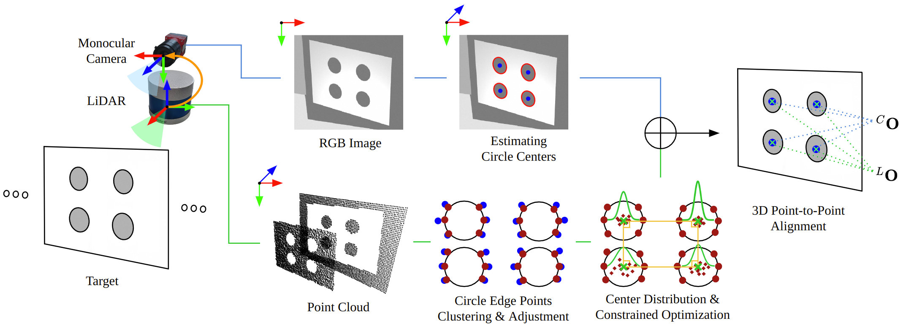

# Camera-LiDAR Extrinsic Calibration using Constrained Optimization with Circle Placement

### Abstract
```
Camera-LiDAR data fusion has demonstrated remarkable environmental perception capabilities in various fields.
The success of data fusion relies on the accurate matching of correspondence features from images and point clouds.
In this letter, we propose a target-based Camera-LiDAR extrinsic calibration by matching correspondences in both data.
Specifically, to extract accurate features from the point cloud, we propose a novel method that estimates the circle centers by optimizing the probability distribution from the initial position. 
This optimization involves generating the probability distribution of circle centers from circle edge points and using the Lagrangian multiplier method to estimate the optimal positions of the circle centers.
We conduct two types of experiments: simulations for quantitative results and real system evaluations for qualitative assessment. 
Our method demonstrates a $21\%$ improvement in simulation calibration performance for 20 target poses with LiDAR noise of $0.03\,m$ compared to existing methods, and also shows high visual quality in re-projecting point cloud onto images in real-world scenarios.
```
### Framework


### Getting Started 
> #### Requirements 
>  > * Ubuntu 20.04 
>  > * Python 3.8
>  > * ROS Noetic 

* LiDAR 
* Camera

### Contact
For any questions, please contact to us at 
[kdh2769@khu.ac.kr](mailto:kdh2769@khu.ac.kr)

### Citation 
Please consider citing this work if you use our code in your research:
```
@
```